# Sports Scheduler

Sports Scheduler is a full-stack web application that allows players to create, join, manage, and cancel sports sessions. Administrators can manage available sports and view reports of completed sessions.

The application provides separate features for Admin and Player users with secure authentication and role-based access.

## Features

### Player Features

- Player registration and login
- Create a new sports session
- Select a sport
- Select players and teams
- Specify additional players required
- Set date, time, and venue
- View available sports sessions
- Join existing sessions
- View joined sessions separately
- View sessions created by the player
- Cancel sessions created by the player
- Provide a cancellation reason
- View cancelled session details
- Change password
- Prevent joining past sessions

### Admin Features

- Admin login
- Create and manage available sports
- Create sports sessions
- Join sports sessions
- View all sessions
- View session details
- View reports of completed sessions
- Analyze sports popularity for a selected period
- Change password

## Authentication

The application uses session-based authentication with Passport.js.

There are two user roles:

- Admin
- Player

Role-based middleware is used to protect admin-only features.

## Technologies Used

- Node.js
- Express.js
- PostgreSQL
- Passport.js
- HTML5
- CSS3
- JavaScript
- REST APIs
- Git & GitHub
- Render

## Database

PostgreSQL is used as the database.

The database contains information related to:

- Users
- Sports
- Sessions
- Teams
- Session participants
- Password reset functionality

Database schema and changes are maintained using SQL migration files.

## Project Structure

- migrations/ - Database migration files
- public/ - Frontend files
- public/css/ - Application styles
- public/js/ - Frontend JavaScript
- public/js/components/ - Authentication, player, admin and account components
- src/ - Backend application
- src/config/ - Database configuration
- src/controllers/ - Application controllers
- src/middleware/ - Authentication middleware
- src/passport/ - Passport authentication configuration
- src/routes/ - API routes
- .env.example - Environment variable template
- package.json - Project dependencies and scripts
- server.js - Application entry point
- README.md - Project documentation

## Screenshots

### Homepage

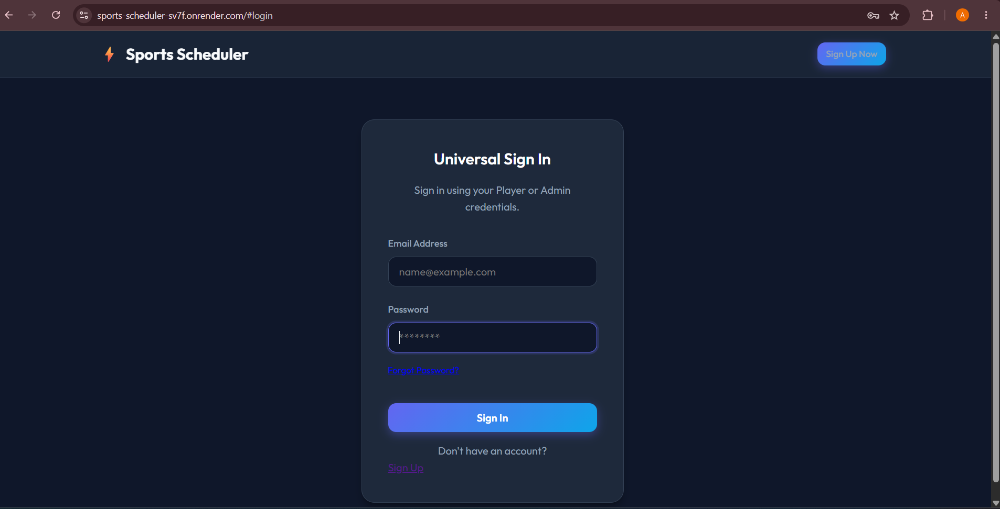

### Admin Dashboard

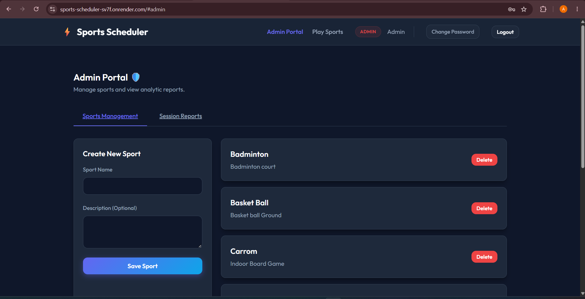

### Admin Reports

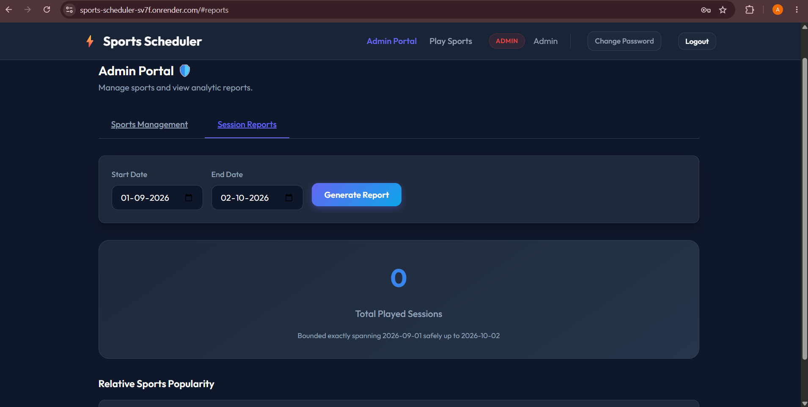

### Available Sessions

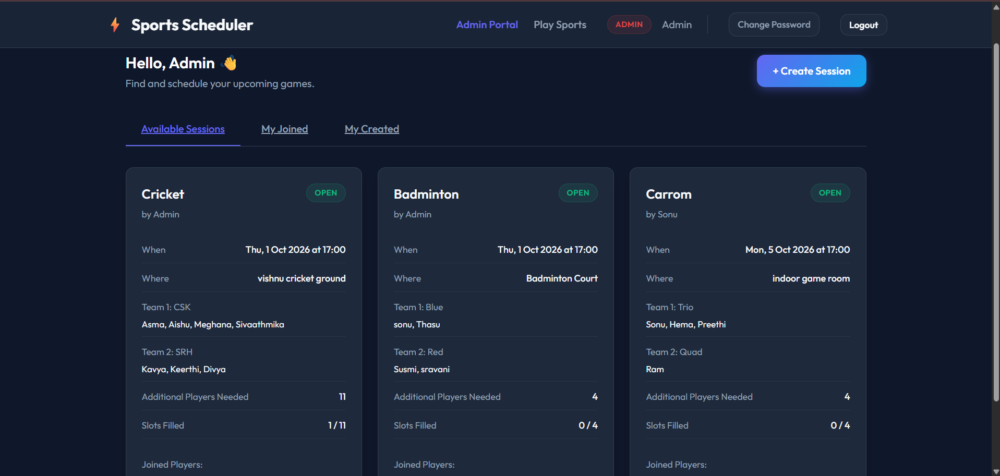

### Create Session

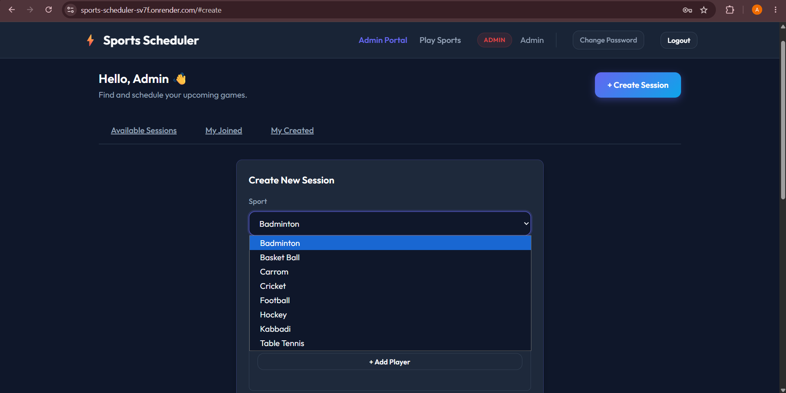

### Create Session - Team Selection

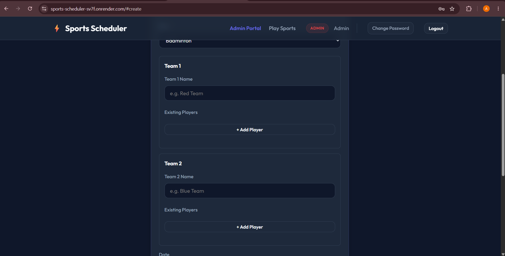

### Create Session - Details

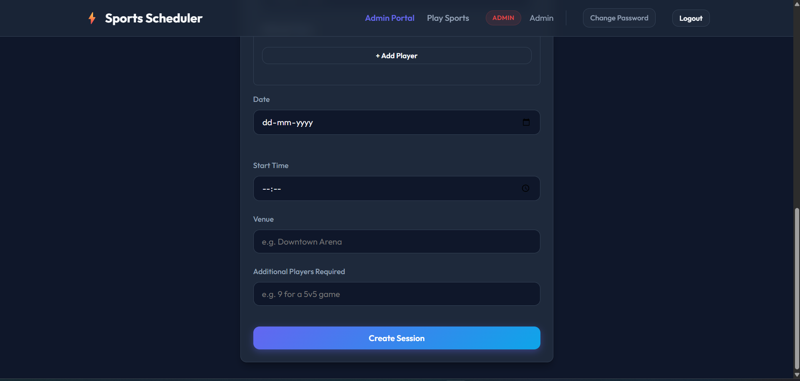

### My Created Sessions

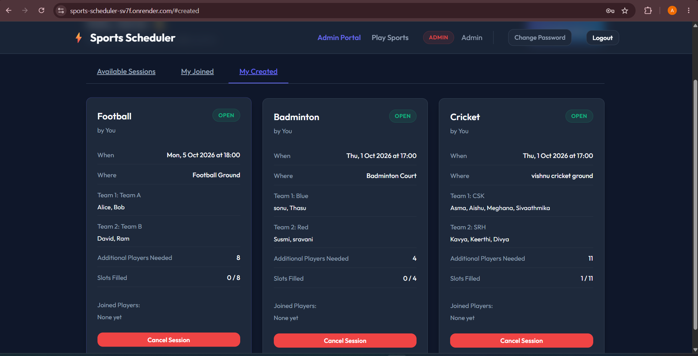

### My Joined Sessions

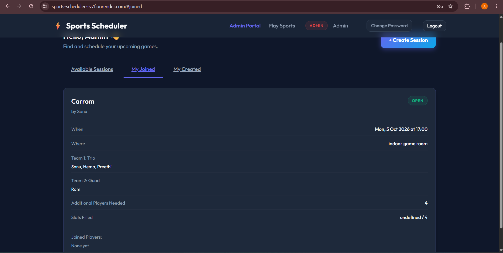

### Cancelled Session

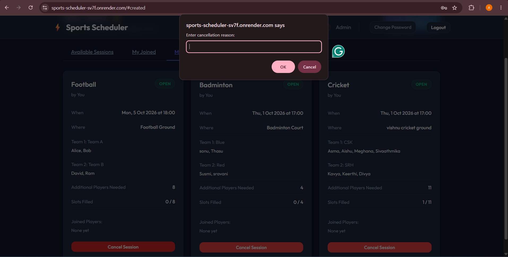

### Cancelled Session Details

### Change Password

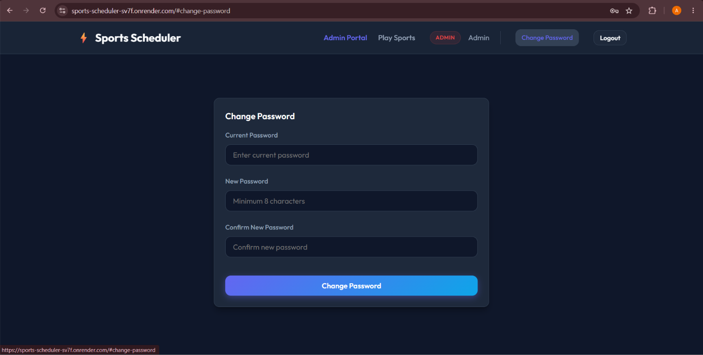

## Live Application

https://sports-scheduler-sv7f.onrender.com

## Demo Video

Demo video link will be added here.

## Deployment

The application is deployed using Render.

The backend server and PostgreSQL database are hosted in the cloud.

## Security

- Passwords are securely hashed before storage.
- Session-based authentication is used.
- Protected routes require authentication.
- Admin-only routes use role-based authorization.
- Environment variables are used for sensitive configuration.
- The .env file is excluded from Git.

## Special Features

- Role-based Admin and Player dashboards
- Sports session creation and joining
- Team-based player selection
- Session cancellation with cancellation reason
- Separate created and joined session sections
- Admin reports with configurable time periods
- Sports popularity analysis
- Password change functionality
- PostgreSQL database integration
- Cloud deployment using Render

## Future Enhancements

- Email notifications for session invitations and cancellations
- Player availability tracking
- Advanced participation analytics
- Automated reminders for upcoming sessions

## Author

Asma Shaik

B.Tech - Artificial Intelligence and Machine Learning